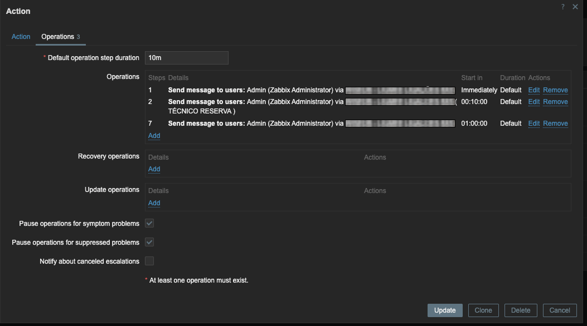
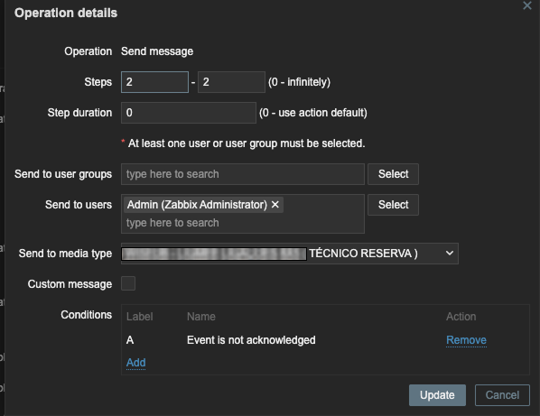

# Módulo Plantão — Zabbix 7.4

Módulo para gerenciar escala de plantão técnico dentro do próprio Zabbix. Desenvolvido para uso com ligações via **[LIGMEE](https://ligmee.com.br)**, plataforma de ligações automatizadas integrada ao Zabbix via media type, mas pode ser adaptado para qualquer media type que use o campo `destination_number`.

A ideia é simples: você cadastra os técnicos com telefone, escala quem está de plantão em cada semana (incluindo um reserva), e o módulo atualiza automaticamente o número nos media types quando a semana atual é salva.


## Requisitos

- Zabbix 7.4
- PostgreSQL
- Usuário com perfil de admin no Zabbix


## Instalação

**1. Copiar o módulo**

```bash
cp -r plantao /usr/share/zabbix/ui/modules/
```

**2. Ativar no Zabbix**

Acesse **Administration → General → Modules**, clique em **Scan directory** e ative o módulo Plantão.

Na primeira ativação as tabelas são criadas automaticamente. Se preferir criar manualmente:

```sql
CREATE TABLE module_plantao_phones (
    userid BIGINT NOT NULL,
    phone  VARCHAR(100) NOT NULL DEFAULT '',
    PRIMARY KEY (userid)
);

CREATE TABLE module_plantao_schedule (
    scheduleid     BIGSERIAL NOT NULL,
    userid         BIGINT NOT NULL,
    userid_reserva BIGINT NULL,
    schedule_date  DATE NOT NULL,
    created_by     BIGINT NOT NULL DEFAULT 0,
    created_at     INTEGER NOT NULL DEFAULT 0,
    PRIMARY KEY (scheduleid),
    UNIQUE (schedule_date)
);
```


## Adaptações necessárias

### 1. IDs dos media types

Os IDs estão hardcoded e precisam ser trocados pelos do seu ambiente. Edite `actions/PlantaoSave.php` e `actions/PlantaoApply.php`:

```php
// Técnico principal — troque 102, 105 pelos seus IDs
' WHERE mediatypeid IN (102, 105)'

// Técnico reserva — troque 108, 109 pelos seus IDs
' WHERE mediatypeid IN (108, 109)'
```

Para consultar os IDs no seu banco:

```sql
SELECT mediatypeid, name FROM media_type WHERE name LIKE '%ligação%';
```

### 2. Filtro de grupo de usuários

Por padrão só aparecem usuários de um grupo específico. Para mudar, edite `actions/PlantaoList.php`:

```php
// troque '%SUAEMPRESA%' pelo nome do grupo no seu ambiente
AND g.name LIKE '%SUAEMPRESA%'
```

Para mostrar todos os usuários, remova o filtro e deixe só `FROM users u`.

### 3. Número genérico para técnico reserva

Quando nenhum reserva é escalado, esse número é gravado nos media types de reserva. Troque pelo fallback do seu ambiente em `PlantaoSave.php` e `PlantaoApply.php`:

```php
$reserva_num = '+55819XXXXXX';
```


## Como o técnico reserva é acionado

O acionamento do reserva acontece via escalonamento no Trigger Actions do Zabbix. O técnico principal recebe a ligação primeiro e, se o evento continuar sem ser reconhecido, o reserva é acionado em seguida.

Exemplo de configuração com 3 operações:

**Step 1** — Imediatamente aciona o técnico principal via media type de ligação principal.
**Step 2** — Após 10 minutos sem reconhecimento, aciona o técnico reserva via media type de ligação reserva.
**Step 7** — Após 1 hora, reaciona o técnico principal.

<p align="center">
  
</p>

O step 2 usa o media type de ligação reserva com a condição "Event is not acknowledged", garantindo que só aciona se o alerta ainda não foi tratado.

<p align="center">
  
</p>

O módulo mantém o `destination_number` atualizado nesses media types automaticamente conforme a escala da semana.

## Como usar

1. Acesse **Plantão → Telefones** e cadastre o telefone de cada técnico
2. Acesse **Plantão → Escala**, clique em uma semana no calendário ou preencha o formulário manualmente
3. Selecione o técnico e, se quiser, o reserva
4. Salve — se for a semana atual, os media types já são atualizados na hora


## Estrutura

```
escala-de-plantao/
├── manifest.json
├── Module.php
├── actions/
│   ├── PlantaoList.php
│   ├── PlantaoSave.php        <- editar IDs dos media types
│   ├── PlantaoApply.php       <- editar IDs dos media types
│   ├── PlantaoDelete.php
│   ├── PhonesList.php
│   └── PhonesSave.php
├── views/
│   ├── plantao.list.php
│   └── phones.list.php
└── assets/
    └── css/
        └── icon.css
```
